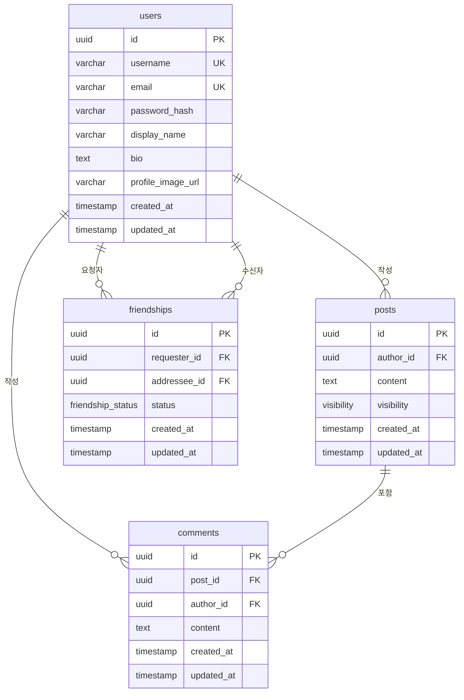

# Database Schema Design

## ER Diagram (Mermaid)



## Enum Types

### `visibility`

게시글 공개 범위를 제어하는 enum.

| 값 | 설명 |
|---|---|
| `public` | 전체 공개 — 누구나 조회 가능 |
| `friends` | 친구만 — 승인된 친구 관계인 사용자만 조회 가능 |
| `private` | 나만 보기 — 작성자 본인만 조회 가능 |

### `friendship_status`

친구 요청의 상태를 나타내는 enum.

| 값 | 설명 |
|---|---|
| `pending` | 요청 대기 중 |
| `accepted` | 수락됨 (양방향 친구 관계 성립) |
| `rejected` | 거절됨 |

## Tables

### `users`

사용자 계정 정보.

| Column | Type | Constraints | Description |
|---|---|---|---|
| `id` | `UUID` | PK, DEFAULT `gen_random_uuid()` | 고유 식별자 |
| `username` | `VARCHAR(30)` | UNIQUE, NOT NULL | 로그인 및 멘션용 아이디 |
| `email` | `VARCHAR(255)` | UNIQUE, NOT NULL | 이메일 주소 |
| `password_hash` | `VARCHAR(255)` | NOT NULL | bcrypt 해시 비밀번호 |
| `display_name` | `VARCHAR(50)` | NOT NULL | 화면 표시 이름 |
| `bio` | `TEXT` | DEFAULT `''` | 자기소개 |
| `profile_image_url` | `VARCHAR(500)` | | 프로필 이미지 URL |
| `created_at` | `TIMESTAMPTZ` | NOT NULL, DEFAULT `NOW()` | 가입일 |
| `updated_at` | `TIMESTAMPTZ` | NOT NULL, DEFAULT `NOW()` | 수정일 |

### `posts`

게시글. `visibility` 컬럼으로 공개 범위를 제어.

| Column | Type | Constraints | Description |
|---|---|---|---|
| `id` | `UUID` | PK, DEFAULT `gen_random_uuid()` | 고유 식별자 |
| `author_id` | `UUID` | FK → `users.id`, NOT NULL | 작성자 |
| `content` | `TEXT` | NOT NULL, CHECK `length <= 280` | 게시글 내용 (280자 제한) |
| `visibility` | `visibility` | NOT NULL, DEFAULT `'public'` | 공개 범위 |
| `created_at` | `TIMESTAMPTZ` | NOT NULL, DEFAULT `NOW()` | 작성일 |
| `updated_at` | `TIMESTAMPTZ` | NOT NULL, DEFAULT `NOW()` | 수정일 |

### `comments`

게시글에 달리는 댓글.

| Column | Type | Constraints | Description |
|---|---|---|---|
| `id` | `UUID` | PK, DEFAULT `gen_random_uuid()` | 고유 식별자 |
| `post_id` | `UUID` | FK → `posts.id`, NOT NULL | 대상 게시글 |
| `author_id` | `UUID` | FK → `users.id`, NOT NULL | 작성자 |
| `content` | `TEXT` | NOT NULL, CHECK `length <= 280` | 댓글 내용 (280자 제한) |
| `created_at` | `TIMESTAMPTZ` | NOT NULL, DEFAULT `NOW()` | 작성일 |
| `updated_at` | `TIMESTAMPTZ` | NOT NULL, DEFAULT `NOW()` | 수정일 |

### `friendships`

친구 관계. 한 쌍의 사용자 간 레코드는 하나만 존재하며, `requester_id < addressee_id` 제약으로 중복을 방지.

| Column | Type | Constraints | Description |
|---|---|---|---|
| `id` | `UUID` | PK, DEFAULT `gen_random_uuid()` | 고유 식별자 |
| `requester_id` | `UUID` | FK → `users.id`, NOT NULL | 친구 요청 보낸 사용자 |
| `addressee_id` | `UUID` | FK → `users.id`, NOT NULL | 친구 요청 받은 사용자 |
| `status` | `friendship_status` | NOT NULL, DEFAULT `'pending'` | 요청 상태 |
| `created_at` | `TIMESTAMPTZ` | NOT NULL, DEFAULT `NOW()` | 요청일 |
| `updated_at` | `TIMESTAMPTZ` | NOT NULL, DEFAULT `NOW()` | 수정일 |

**제약 조건:**
- `UNIQUE(requester_id, addressee_id)` — 동일 쌍 중복 방지
- `CHECK(requester_id <> addressee_id)` — 자기 자신에게 친구 요청 불가

## Indexes

```sql
-- users
CREATE UNIQUE INDEX idx_users_username ON users (username);
CREATE UNIQUE INDEX idx_users_email    ON users (email);

-- posts
CREATE INDEX idx_posts_author_id  ON posts (author_id);
CREATE INDEX idx_posts_created_at ON posts (created_at DESC);
CREATE INDEX idx_posts_visibility ON posts (visibility);

-- comments
CREATE INDEX idx_comments_post_id   ON comments (post_id);
CREATE INDEX idx_comments_author_id ON comments (author_id);

-- friendships
CREATE INDEX idx_friendships_addressee_status ON friendships (addressee_id, status);
CREATE INDEX idx_friendships_requester_status ON friendships (requester_id, status);
```

## 게시글 권한 조회 로직

`visibility`에 따른 게시글 조회 필터링 예시:

```sql
SELECT p.*
FROM posts p
WHERE
  -- 전체 공개
  p.visibility = 'public'
  -- 본인 게시글
  OR p.author_id = :current_user_id
  -- 친구 공개 + 친구 관계 확인
  OR (
    p.visibility = 'friends'
    AND EXISTS (
      SELECT 1 FROM friendships f
      WHERE f.status = 'accepted'
        AND (
          (f.requester_id = p.author_id AND f.addressee_id = :current_user_id)
          OR (f.requester_id = :current_user_id AND f.addressee_id = p.author_id)
        )
    )
  )
ORDER BY p.created_at DESC;
```
